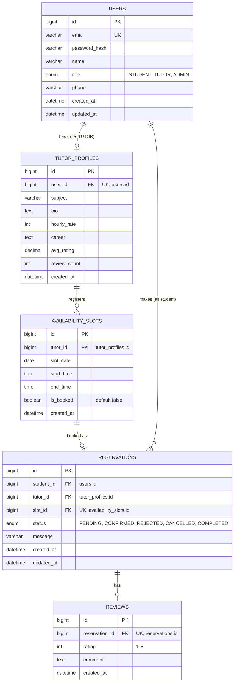

# TutorMatch — 1:1 튜터링 예약 시스템 설계 문서

React + Spring Boot 풀스택 포트폴리오 프로젝트. Phase 1(MVP)은 예약 시스템, Phase 3에서 AI 기능을 얹는 것을 목표로 한다.

## 1. 기능 범위

**사용자 역할**: STUDENT, TUTOR (ADMIN은 추후 필요 시 확장)

**MVP 기능**
- 회원가입/로그인 (JWT), 가입 시 역할 선택
- 튜터: 프로필 등록(과목/소개/시급/경력), 예약 가능 시간대 등록·삭제
- 학생: 튜터 검색(과목/가격 필터), 상세 조회, 예약 가능 시간 확인 후 예약 신청
- 예약 흐름: 학생 신청(PENDING) → 튜터 승인/거절(CONFIRMED/REJECTED) → 완료(COMPLETED) 또는 취소(CANCELLED)
- 동시 예약 방지: 같은 튜터의 같은 시간대 중복 예약 불가
- 리뷰: COMPLETED 예약에 한해 학생이 별점+코멘트 작성
- 마이페이지: 학생/튜터별 예약 내역 조회

**Phase 2 이후 (확장)**
- 튜터 대시보드 통계(예약률, 평점 추이)
- 알림 (이메일/인앱)
- AI 자연어 예약 도우미 챗봇 (LLM 연동)

## 2. DB 스키마 (ERD)



**제약조건**
- `availability_slots`: `(tutor_id, slot_date, start_time)` UNIQUE — 같은 튜터가 같은 시간대 슬롯 중복 등록 방지
- `reservations`: `slot_id` UNIQUE — 슬롯당 예약 1건만 허용, DB 레벨에서 이중 예약 차단
  - 이 제약으로 인해 슬롯은 1회성 소모 자원이다: 예약이 REJECTED/CANCELLED로 바뀌어도 해당 슬롯은 재예약 대상에서 제외된다(같은 slot_id로 새 예약 row 생성 불가). 튜터가 같은 시간대를 다시 열고 싶다면 새 슬롯을 등록해야 한다.

**동시성 처리**
두 학생이 동시에 같은 슬롯을 예약 시도하는 race condition은 (1) `slot_id` UNIQUE 제약과 (2) 예약 생성 트랜잭션 내 슬롯 조회 시 `PESSIMISTIC_WRITE` 락으로 이중 방어한다. 이력서에서 "동시성 이슈 해결 경험"으로 설명할 수 있는 핵심 포인트.

## 3. REST API 명세

**Auth**
| Method | Endpoint | 설명 |
|---|---|---|
| POST | /api/auth/signup | 회원가입 (email, password, name, role) |
| POST | /api/auth/login | 로그인, JWT 발급 |
| POST | /api/auth/refresh | 토큰 갱신 |

**Tutors**
| Method | Endpoint | 설명 |
|---|---|---|
| GET | /api/tutors?subject=&minPrice=&maxPrice=&page= | 튜터 검색/목록 |
| GET | /api/tutors/{tutorId} | 튜터 상세 (프로필+평점) |
| POST | /api/tutors/profile | 튜터 프로필 등록 (TUTOR 권한) |
| PUT | /api/tutors/profile | 튜터 프로필 수정 |

**Availability**
| Method | Endpoint | 설명 |
|---|---|---|
| GET | /api/tutors/{tutorId}/availability?from=&to= | 예약 가능 시간 조회 |
| POST | /api/tutors/{tutorId}/availability | 슬롯 등록 (본인만) |
| DELETE | /api/availability/{slotId} | 슬롯 삭제 (미예약 상태만) |

**Reservations**
| Method | Endpoint | 설명 |
|---|---|---|
| POST | /api/reservations | 예약 신청 (slotId, message) |
| GET | /api/reservations/me?role=&status= | 내 예약 목록 |
| GET | /api/reservations/{id} | 예약 상세 |
| PATCH | /api/reservations/{id}/status | 상태 변경 (CONFIRM/REJECT: 튜터, CANCEL: 양측, COMPLETE: 튜터) |

**Reviews**
| Method | Endpoint | 설명 |
|---|---|---|
| POST | /api/reservations/{id}/review | 리뷰 작성 (COMPLETED만, 학생) |
| GET | /api/tutors/{tutorId}/reviews?page= | 튜터 리뷰 목록 |

인증은 JWT Bearer + Spring Security, 역할 기반 접근 제어는 `@PreAuthorize`로 처리.

## 4. 기술 스택

**Frontend**: React 18 + TypeScript, Vite, React Router, React Query, Zustand(인증 상태), Axios(JWT interceptor), Tailwind CSS

**Backend**: Spring Boot 3.x, Spring Security + JWT(jjwt), Spring Data JPA, Bean Validation, Gradle

**DB**: 개발 H2 / 운영 MySQL 8

**Infra(선택)**: Docker Compose(backend+mysql), Railway/Render 또는 AWS EC2 배포

## 5. 폴더 구조

**Backend** (도메인 중심)
```
com.tutormatch
├─ auth          (JWT, SecurityConfig)
├─ user
├─ tutor
├─ availability
├─ reservation
├─ review
└─ common        (exception, response wrapper)
```

**Frontend**
```
src/
├─ api/          (axios client, endpoint 함수)
├─ features/     (auth, tutors, reservations, reviews)
├─ components/
├─ hooks/
└─ pages/
```

## 6. 로드맵

- **Phase 1 (MVP, 이번 설계 범위)**: 인증, 튜터 프로필, 슬롯 등록, 예약 신청/승인, 리뷰
- **Phase 2**: 튜터 대시보드 통계, 알림(이메일/인앱)
- **Phase 3 (AI, 추후 논의)**: 자연어 예약 도우미 챗봇 — LLM API로 "다음주 화요일 오후 2시에 김선생님 예약해줘" 같은 문장을 파싱해 예약 API 호출

## 7. 이력서 어필 포인트

- DB UNIQUE 제약 + 비관적 락으로 동시 예약 충돌 방지 (동시성 이슈 해결 경험)
- JWT 기반 인증/인가, Role 기반 API 접근 제어
- React Query로 서버 상태 캐싱·재검증 처리
- (Phase 3 진행 시) LLM 연동 경험 추가
